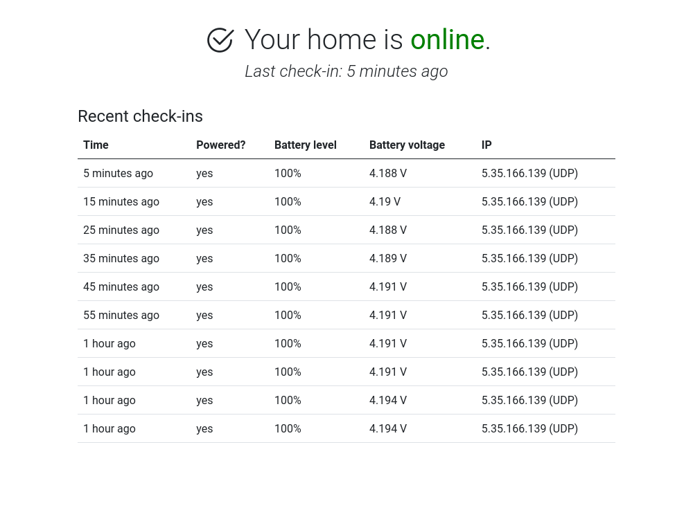

# homemon

	
	

homemon is a set of programs that let you check that your home's power is on, meaning you can distinguish between an Internet outage and a power outage. You install a program on a central server and another on a physical device, and the device sends regular reports to your server via a cellular connection.

The main target physical device is an Alcatel MW41 mobile hotspot, which you can [get root access on](https://alex.studer.dev/2021/01/04/mw41-1). A mobile hotspot is ideal for this because it has a cellular connection and a battery, meaning that it can keep sending reports if the power actually does go out.

## Components
There are three different components:
* [homemon-daemon](https://github.com/thatoddmailbox/homemon-daemon) - The program that runs on a device and regularly sends reports to a server.
* [homemon-server](https://github.com/thatoddmailbox/homemon-server) - Receives reports over HTTP, logs them, and provides a web UI to view the most recent data.
* [homemon-receiver](https://github.com/thatoddmailbox/homemon-receiver) - (optional) Receives reports over an efficient UDP-based protocol. Only needed if you want to use the UDP transport.

## Transports
There are two methods of sending reports:
* HTTP - makes a POST request to [homemon-server](https://github.com/thatoddmailbox/homemon-server). Simple to set up and maintain.
* UDP - fires a UDP packet with report data to [homemon-receiver](https://github.com/thatoddmailbox/homemon-receiver). More complex setup, but uses significantly less data. (estimated to be around 90 bytes per report, as counted by T-Mobile's network)

## Setup
1. Choose one of the transports listed above, either HTTP or UDP. If you don't know which, choose HTTP. (UDP is only useful if you want to minimize the amount of data used)
2. Set up homemon-server [with these instructions](https://github.com/thatoddmailbox/homemon-server#setup).
3. If you're using the UDP transport, set up homemon-receiver [with these instructions](https://github.com/thatoddmailbox/homemon-receiver#readme).
4. Finally, set up homemon-daemon [with these instructions](https://github.com/thatoddmailbox/homemon-daemon#readme).

## Protocol
This section describes the format of the packets being sent if you use the UDP transport.

Each UDP payload is 43 bytes in total, split into a data portion (11 bytes) and a signature (32 bytes). The data portion is as follows:

* Battery capacity and USB power flag (1 byte) - the battery percentage level, from 0 to 100%. In addition, the topmost bit of this byte tells you if USB power is connected or not.
* Battery voltage and flags (2 bytes, big endian) - The current voltage of the battery, in milliVolts. The top three bits are used for flags, as follows:
	* The first bit indicates if there was an error reading the current USB power state. If it is set, then you should disregard the state of the USB power flag in the previous byte.
	* The remaining two bits are reserved for future use.
* Message timestamp (8 bytes, big endian) - The Unix timestamp (in seconds) when the message was sent.

Then, compute the HMAC-SHA256 signature of these 11 bytes of data. The key must be set in advance to match in both the daemon and the receiver (in their respective config files, it's called the token). This signature is appended to the end of the data above to create the final UDP payload of 43 bytes.